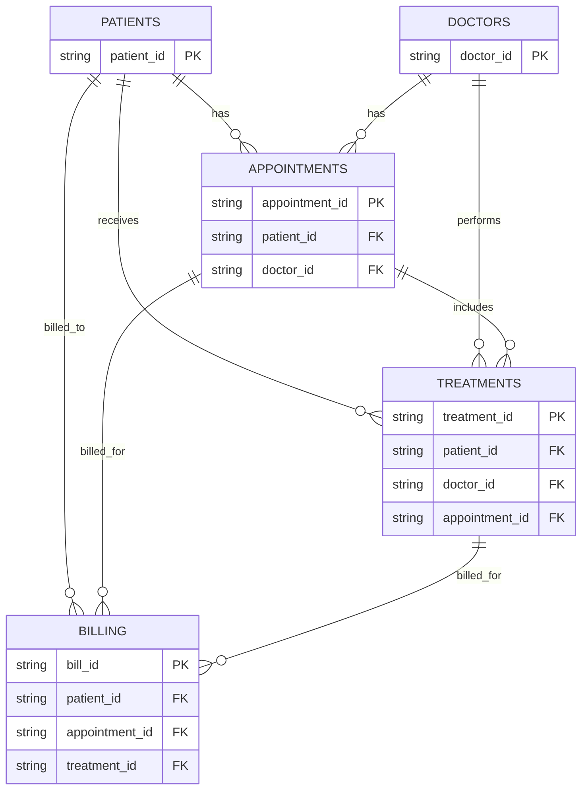

# Data Model

This document describes the conceptual healthcare data model used for the End-to-End Hospital Analytics POC. It is based on the following source CSV files:

- `patients.csv`
- `doctors.csv`
- `appointments.csv`
- `treatments.csv`
- `billing.csv`

## Entity Definitions

### Patients

- **Table purpose**: Stores demographic and contact information for each patient.
- **Primary key**: `patient_id`
- **Foreign keys**: None
- **Relationships**:
  - One patient can have many appointments.
  - One patient can receive many treatments.
  - One patient can have many billing records.

### Doctors

- **Table purpose**: Stores professional and contact information for each doctor.
- **Primary key**: `doctor_id`
- **Foreign keys**: None
- **Relationships**:
  - One doctor can be assigned to many appointments.
  - One doctor can perform many treatments.

### Appointments

- **Table purpose**: Stores scheduled visits between patients and doctors.
- **Primary key**: `appointment_id`
- **Foreign keys**:
  - `patient_id` references `patients.patient_id`
  - `doctor_id` references `doctors.doctor_id`
- **Relationships**:
  - Many appointments belong to one patient.
  - Many appointments are handled by one doctor.
  - One appointment can be associated with many treatments.
  - One appointment can have many billing records.

### Treatments

- **Table purpose**: Stores medical procedures, medications, or services provided.
- **Primary key**: `treatment_id`
- **Foreign keys**:
  - `patient_id` references `patients.patient_id`
  - `doctor_id` references `doctors.doctor_id`
  - `appointment_id` references `appointments.appointment_id`
- **Relationships**:
  - Many treatments are given to one patient.
  - Many treatments are performed by one doctor.
  - Many treatments are linked to one appointment.
  - One treatment can appear in many billing records.

### Billing

- **Table purpose**: Stores invoice and payment information for appointments and treatments.
- **Primary key**: `bill_id`
- **Foreign keys**:
  - `patient_id` references `patients.patient_id`
  - `appointment_id` references `appointments.appointment_id`
  - `treatment_id` references `treatments.treatment_id`
- **Relationships**:
  - Many billing records belong to one patient.
  - Many billing records are associated with one appointment.
  - Many billing records are associated with one treatment.

## Entity-Relationship Diagram

